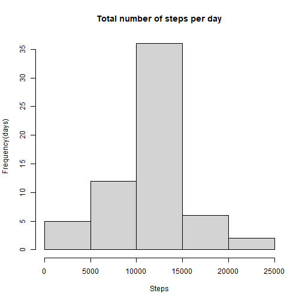

## Loading and preprocessing the data
First of all, load required package for our Analysis.

```r
library(stats)
library(base)
library(dplyr)
library(ggplot2)
```
Package load completed.
<br/><br/>
For Analysis, load data and assign it to object 'activity'.

```r
activity <- read.csv('activity.csv')
```
<br/>
Here are several samples of data.

```r
head(activity)
```

```
##   steps       date interval
## 1    NA 2012-10-01        0
## 2    NA 2012-10-01        5
## 3    NA 2012-10-01       10
## 4    NA 2012-10-01       15
## 5    NA 2012-10-01       20
## 6    NA 2012-10-01       25
```

There are 3 variables : 'steps', 'date', 'interval', which of 3 means,  

* steps : Number of steps taking in a 5-minute interval  
* date : The date on which the measurement was taken  
* interval : Identifier for the 5-minute interval in which measurement was taken
<br/><br/>

  
  
    
## What is mean total number of steps taken per day?
First, group the original data by 'date' variable. And calculate 
total numbers of steps of each date group.


```r
total_step_per_day <- activity %>% group_by(date) %>% 
  summarize(total=sum(steps, na.rm = TRUE))
```
<br/>
Here are several results of this calculation.

```r
head(total_step_per_day)
```

```
## # A tibble: 6 × 2
##   date       total
##   <chr>      <int>
## 1 2012-10-01     0
## 2 2012-10-02   126
## 3 2012-10-03 11352
## 4 2012-10-04 12116
## 5 2012-10-05 13294
## 6 2012-10-06 15420
```
<br/>
And plot histogram of it.

```r
hist(total_step_per_day$total, 
     xlab = 'Steps', ylab = 'Frequency(days)',
     main = 'Total number of steps per day')
```


And then, calculate the mean and median of these total number of steps

```r
mean_steps_per_day <- mean(total_step_per_day$total)
median_steps_per_day <- median(total_step_per_day$total)
mean_steps_per_day
```

```
## [1] 9354.23
```

```r
median_steps_per_day
```

```
## [1] 10395
```

the mean value is 9354.2295082, and the median value is 10395.
<br/><br/>

## What is the average daily activity pattern?
To examine it, We will make a time series plot of the 5-minute interval (x-axis) and the average number of steps taken, all days (y-axis).  
For this, We will group the original data by interval value, and
calculate the average value of steps for each interval group.  
The following is the code to do that.


```r
aver_steps_per_5min <- activity %>% group_by(interval) %>%
  summarize(aver = mean(steps, na.rm = TRUE))
```

and plot it.

```r
with(aver_steps_per_5min, 
     plot(interval, aver, type = 'l', xlab='Interval',
          ylab='Steps', main='Average number of steps per 5-minutes'))
```


Which 5-minute interval, on average across all the days in the dataset, contains the maximum number of steps?

```r
interval_max <- 
  aver_steps_per_5min$interval[which.max(aver_steps_per_5min$aver)]
interval_max
```

```
## [1] 835
```

The interval that contain maximum number of steps is, 835.

<br/><br/>

## Imputing missing values
And let's impute missing values.  
How many missing values in the original dataset(object 'activity')?

```r
total_NA <- sum(is.na(activity$steps))
total_NA
```

```
## [1] 2304
```
There are 2304 of missing values.<br/>
Let's fill it with the average number of steps per each of 5-minutes interval.


```r
NA_data <- activity[is.na(activity$steps),]

for(i in 1:2304){
  NA_data$steps[i] <- aver_steps_per_5min$aver[aver_steps_per_5min$interval 
                                               == NA_data$interval[i]]
}
```
<br/>
Here are some samples of the result value that we filled.

```r
head(NA_data)
```

```
##       steps       date interval
## 1 1.7169811 2012-10-01        0
## 2 0.3396226 2012-10-01        5
## 3 0.1320755 2012-10-01       10
## 4 0.1509434 2012-10-01       15
## 5 0.0754717 2012-10-01       20
## 6 2.0943396 2012-10-01       25
```
<br/>
And then let's make a new dataset by putting filled data into the original dataset!

```r
New_activity <- activity
New_activity[is.na(activity$steps),] <- NA_data
```

If we check there are missing values in new dataset,

```r
sum(is.na(New_activity))
```

```
## [1] 0
```

There is no missing value.  
<br/><br/>
Let's see the total number of steps taken each day again with our new dataset!

```r
New_total_steps_per_day <- New_activity %>% group_by(date) %>%
  summarize(total=sum(steps))
hist(New_total_steps_per_day$total, 
     xlab = 'Steps', ylab = 'Frequency(days)',
     main = 'Total number of steps per day')
```



And also calculate the mean and median value again.

```r
New_mean_per_day <- mean(New_total_steps_per_day$total)
New_median_per_day <- median(New_total_steps_per_day$total)
options(scipen=999)
New_mean_per_day
```

```
## [1] 10766.19
```

```r
New_median_per_day
```

```
## [1] 10766.19
```

the mean value of total number of steps per each day is 10766.1886792  
the median value of it is 10766.1886792, in comparison with the fact that each of those values are 9354.2295082, 10395 in original data.


## Are there differences in activity patterns between weekdays and weekends?
To figure out it, we will make new variable 'level' that indicates whether a given date is a weekday or weekend day.  
To do it, we convert the 'date' variable from 'character' class into 'Date' class.

```r
weekday <- c('월요일', '화요일', '수요일', '목요일', '금요일')
weekend <- c('토요일', '일요일')
New_activity$date <- as.Date(New_activity$date, format = "%Y-%m-%d")
```

```r
class(New_activity$date)
```

```
## [1] "Date"
```
Conversion completed

And then assign the 'level' value('weekday' or 'weekend') to each rows of data in according to the result value of 'weekdays()' function of 'date' variable.

```r
for(i in 1:nrow(New_activity)){
  if(weekdays(New_activity$date[i]) %in% weekday){
    New_activity$level[i] <- 'weekday'
  } else if(weekdays(New_activity$date[i]) %in% weekend){
    New_activity$level[i] <- 'weekend'
  }
}
```

```r
table(New_activity$level)
```

```
## 
## weekday weekend 
##   12960    4608
```
Assign completed.


And let's see the time-series average number of steps take for 5-minutes interval for each level.  
For this, group the new data with added 'level' column by level and calculate the mean value for each groups.


```r
two_level_activity <- New_activity %>% group_by(level, interval) %>% 
  summarize(average=mean(steps))
```

And plot it.

```r
g <- qplot(interval, average, data = two_level_activity, geom = 'line',
      facets=level~., 
      color=level, xlab = 'Interval', ylab = 'Steps',
      main = 'Average number of steps per 5-minutes interval')
```

```r
g + theme(plot.title=element_text(hjust=0.5))
```


